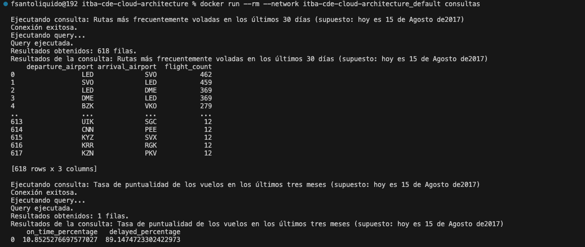
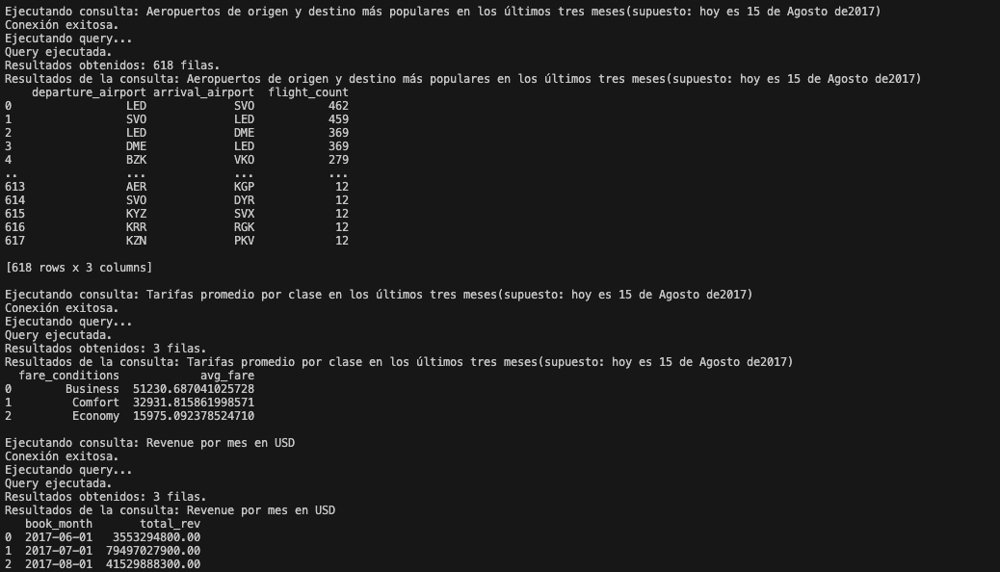

## Resolución Ejercicio 5

Luego de la ejecución la creación del Dockerfile.consultas, lo levantamos con:

``docker build -f Dockerfile.consultas -t consultas . ``

Luego, ejecutamos el archivo con las consultas de consultas.py con: 

``docker run --rm --network itba-cde-cloud-architecture_default consultas``

El resultado con los datos productivos es: 

